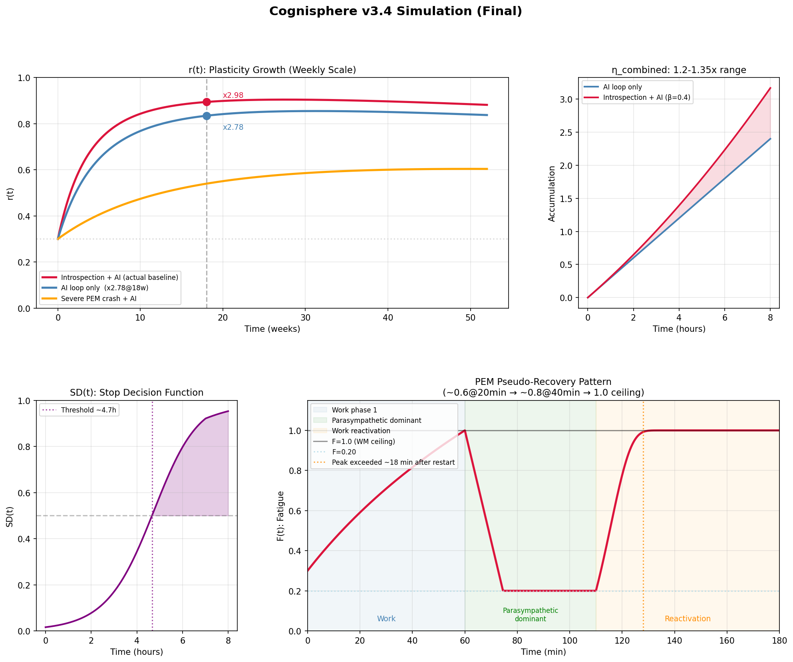

# Cognisphere v3.4
## Personal Cognitive Architecture Model

Built from internal observation → formally specified



---

## Overview

**Cognisphere v3.4** is a formal model of a **single individual's cognitive processing architecture**.

It is **not** proposed as a universal theory of mind.  
It is a **personal cognitive architecture**: a structured attempt to describe how one mind processes known vs. unknown content, stabilizes output, compresses language, and behaves under chronic fatigue-like constraints.

This repository includes:

- a lightweight overview
- a conceptual definition
- a mathematical definition
- a concept ↔ math cross-reference
- a PDF version
- simulation output

---

## What is this?

This project began from direct internal observation and long-term introspective analysis, especially around recurring patterns such as:

- high-density cognitive compression
- known/unknown processing bifurcation
- quiet convergence after deep cognition
- PEM-like pseudo-recovery dynamics
- structural flexibility growth through introspection + AI-assisted refinement

The goal is **not** to claim general truth.  
The goal is to make a personal cognitive structure **legible, inspectable, and discussable** in a formal way.

You can think of Cognisphere as a:

- personal cognitive OS model
- formalized introspection architecture
- phenomenology → structure translation
- human–AI co-modeling artifact

---

## Start here

If you are new to this project, read in this order:

1. [`cognisphere_v3_4_lite.md`](./cognisphere_v3_4_lite.md) — shortest and easiest overview  
2. [`cognisphere_v3_4_concept.md`](./cognisphere_v3_4_concept.md) — conceptual definition  
3. [`cognisphere_v3_4_definition.md`](./cognisphere_v3_4_definition.md) — formal mathematical specification  
4. [`cognisphere_v3_4_crossref.md`](./cognisphere_v3_4_crossref.md) — concept ↔ math correspondence  
5. [`cognisphere_v3_4.pdf`](./cognisphere_v3_4.pdf) — compact compiled version  

---

## Core structure

The model describes cognition as a layered process:

```text
Layer 0  -> always-on metacognitive observation
   ↓
K-flag   -> retrospective judgment of dominant operation mode
   ↓
L1       -> unknown-content sculpting / exploratory deepening
or
L1'      -> known-content reconstruction / recombination
   ↓
Layer 2  -> high-density compressed language output

Structural interpretation

Layer 0
Basal steady-state metacognitive observation.
Not identical to active reasoning, but continuously present as an observing substrate.

K-flag
A post hoc judgment of whether the main operation was dominated by:

unknown-content sculpting (K = 1)

known-content reconstruction (K = 0)


L1
Deep engagement with partially unknown structure.
Characterized by sculpting, descent, nontrivial formation, and emergence.

L1'
Reorganization of already-known structure.
Characterized by reconstruction, recombination, and patterned reassembly.

Layer 2
Stabilized expression layer.
Produces high-density compressed output after internal processing converges.


---

Main variables

K ∈ {0,1}

A discrete operational flag indicating which processing mode was dominant.

K = 1 → L1-dominant (unknown-content sculpting)

K = 0 → L1'-dominant (known-content reconstruction)


r(t) ∈ [0,1]

Plasticity parameter representing structural flexibility of the cognitive architecture over time.

This does not mean emotional intensity.
It refers to cognitive deformation tolerance, structural adaptability, and dynamic softness.

Φ(Θ,t,r) ≈ 0

Convergence condition representing stable internal resolution.

This corresponds not to explosive closure, but to a quiet landing.

SD(t)

Stop-decision function representing continuous volitional stopping.

This means stopping is modeled as an internal decision dynamic, not merely interruption by exhaustion.


---

What is distinctive here

This model is built around several specific commitments:

Known and unknown processing are operationally distinguished

L1 and L1' are exclusive in dominance, but transitions between them are allowed

Compressed output is treated as a structural property

Plasticity is explicitly modeled through r(t)

Convergence is treated as quiet stabilization rather than abrupt completion

PEM-like pseudo-recovery is formalized, not merely described phenomenologically

The model is designed from first-person cognition outward, not from population-level abstraction inward


---

Repository contents

cognisphere_v3_4_lite.md

Simplified, human-readable introduction.

cognisphere_v3_4_concept.md

Conceptual / phenomenological definition of the architecture.

cognisphere_v3_4_definition.md

Formal mathematical definition.

cognisphere_v3_4_crossref.md

Mapping between conceptual and mathematical layers.

cognisphere_v3_4.pdf

Compiled specification for compact reading or sharing.

cognisphere_v3_4_simulation_final.png

Simulation figure.


---

Selected findings

1. Plasticity growth

The model includes a saturating growth view of r(t) over time.

Current framing:

introspection + AI loop yields the strongest growth

AI-only support still improves growth

severe crash states suppress growth but do not reduce it to zero

recovery is nonlinear rather than monotonic


2. Quiet convergence

Deep cognition in this model does not necessarily end in dramatic closure.

Instead, resolution often appears as:

gradual stabilization

density-preserving landing

lossless compression into language

calm settling after internal restructuring


3. PEM pseudo-recovery

One of the central observations formalized here is a pseudo-recovery pattern:

apparent recovery may occur under reduced load

reactivation can produce rapid fatigue rebound

subjective recovery and structural recovery are not identical

apparent improvement does not imply full restoration

recovery dynamics must be modeled separately from momentary relief


---

Operating constraints

This model includes real-world constraint conditions affecting cognitive operation.

These are not the model itself, but conditions under which the modeled cognition operates.

Examples may include:

PEM-like fatigue dynamics

chronic sleep disruption

stress-linked fluctuation

long-horizon recovery asymmetry

constraint-sensitive cognitive throughput


These conditions matter because they alter:

accessible depth

stabilization speed

stop-decision dynamics

apparent recovery curves

effective cognitive output bandwidth


---

Scope and limitations

This repository describes a single-person cognitive architecture.

It should not be read as:

a clinical diagnostic system

a treatment model

a general theory of cognition

a population-level scientific claim


It is better understood as a formalized model located between:

phenomenology

cognitive architecture

metacognition

personal science

human–AI collaborative modeling


---

Who this may be useful for

This repository may be relevant to people interested in:

cognitive architecture

metacognition

introspection formalization

phenomenological structure mapping

personal science

human–AI co-modeling

compression-oriented cognition

formal representation of subjective structure


---

Version

Current version: v3.4

Key characteristics of v3.4 include:

K-flag defined as operational judgment rather than naive mode labeling

clearer exclusivity + transition relation between L1 and L1'

stronger alignment between conceptual and mathematical definitions

integrated treatment of convergence, plasticity, and recovery dynamics

more stable mapping between phenomenology and formal structure


---

Suggested citation / reference style

If referencing this work, please cite it as a personal cognitive architecture model / formal introspection model rather than a general cognitive theory.

Suggested wording:

> Cognisphere v3.4: a formal personal cognitive architecture model based on introspection and iterative human–AI refinement.


---

License / usage

Academic reference with attribution is welcome.

For commercial use, derivative reuse beyond standard citation, or formal redistribution, please ask permission first.


---

Closing note

Cognisphere v3.4 is an attempt to formalize cognition from the inside out.

Not as universality.
Not as diagnosis.
But as structure.

A mind made inspectable.
